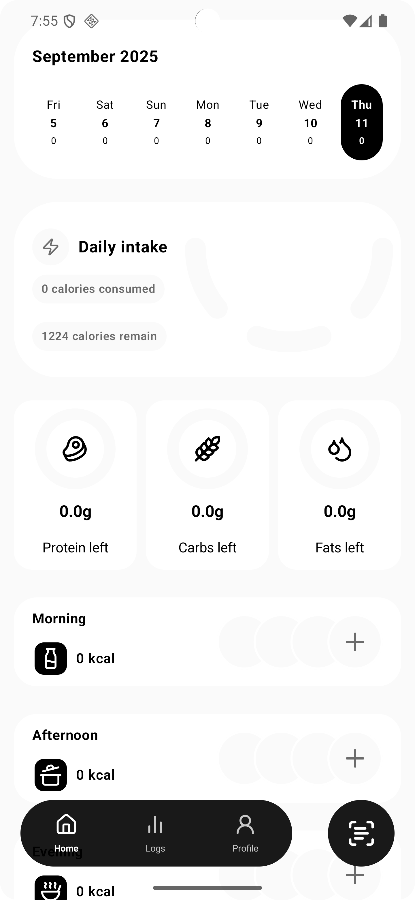
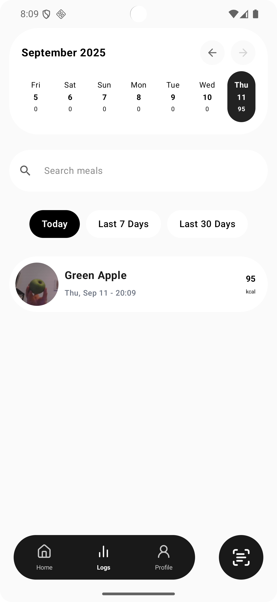
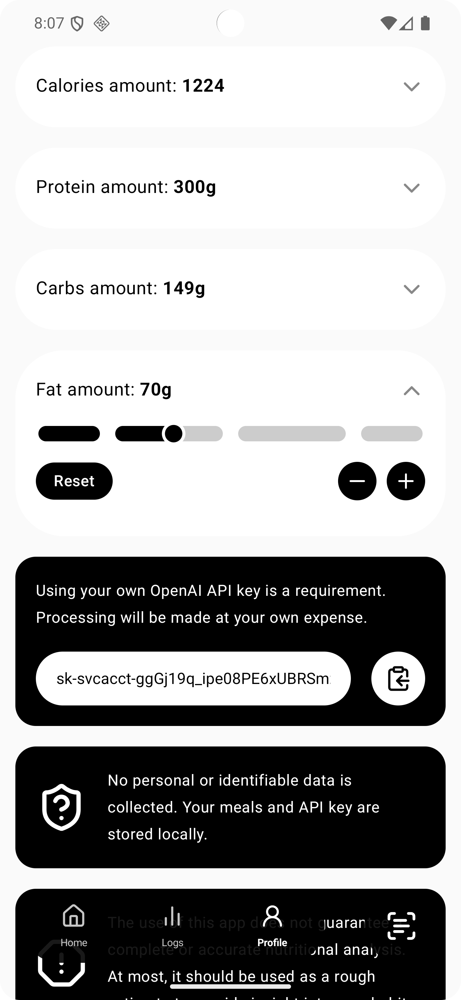
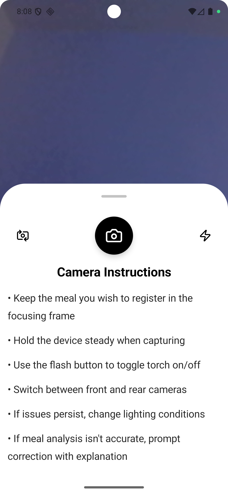
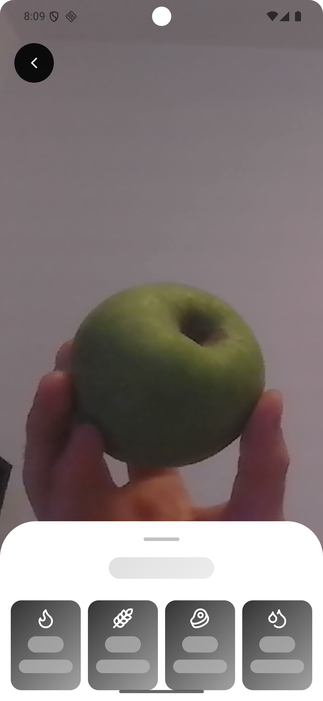
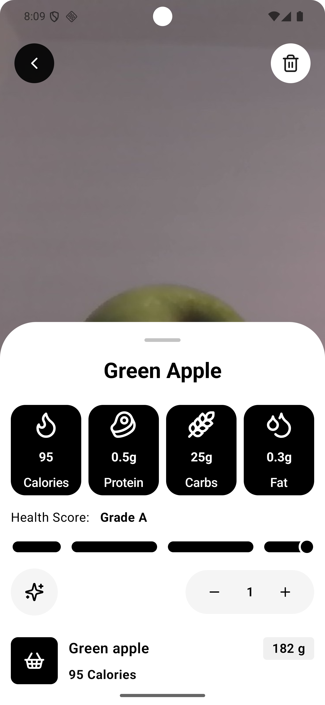

# Calorie Tracker

A modern, open-source Android app for tracking calories, fat, carbs, and protein. Log your meals by simply taking a picture—nutrition is extracted automatically using the OpenAI API.

## Features
- **Photo-based meal logging:** Take a picture of your food, and the app estimates calories, fat, carbs, and protein.
- **Automatic nutrition analysis:** Uses OpenAI API to process images and extract nutrition data.
- **Home dashboard:** View your daily summary and progress at a glance.
- **Meal logs:** Browse your meal history and nutrition breakdowns.
- **Profile management:** Adjust your user preferences and provide OpenAI API key. All data is stored locally.
- **Detailed meal view:** Inspect, correct, and analyze each meal’s nutrition.

## How It Works
1. Open the scanner and take a photo of your meal.
2. The app uploads the image and requests nutrition analysis from an OpenAI prompt template.
3. Nutrition data is parsed and saved to your local log.
4. View, edit, or analyze your meals anytime.

## Download

Get the latest APK from the [releases page]

## Screenshots

### Home

### Logs

### Profile

### Scanning

### Awaiting Scan

### Meal Details

## License
MIT — see [LICENSE.md](LICENSE.md) for details.

## Privacy & Security
- Images are sent to OpenAI for analysis; 
- An innocent ping is sent on a daily basis to track active users.

## Known issues
- Input fields can't be exited properly on older versions of android (confirmed working as of android 16 and broken on android 8).
- Splash screen isn't working on older version of android (confirmed working as of android 16 and broken on android 8).